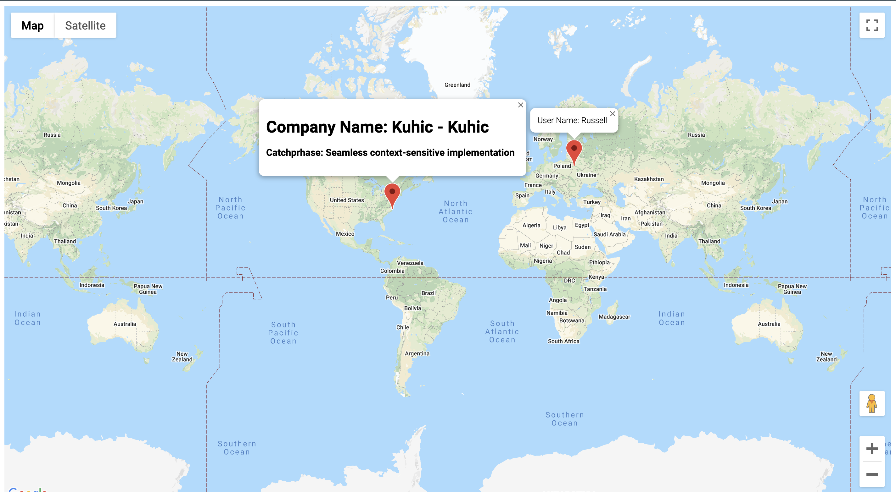
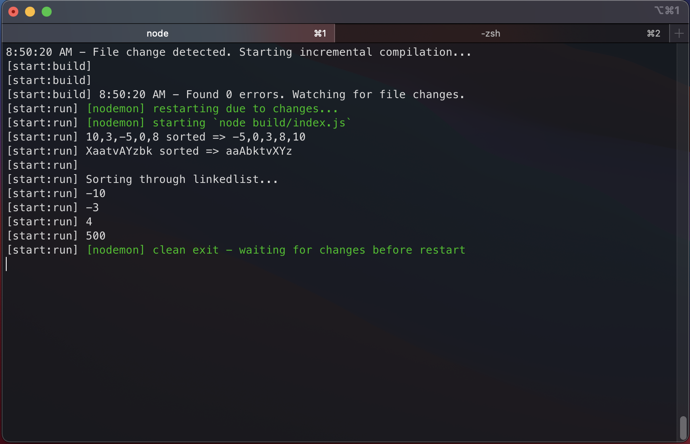
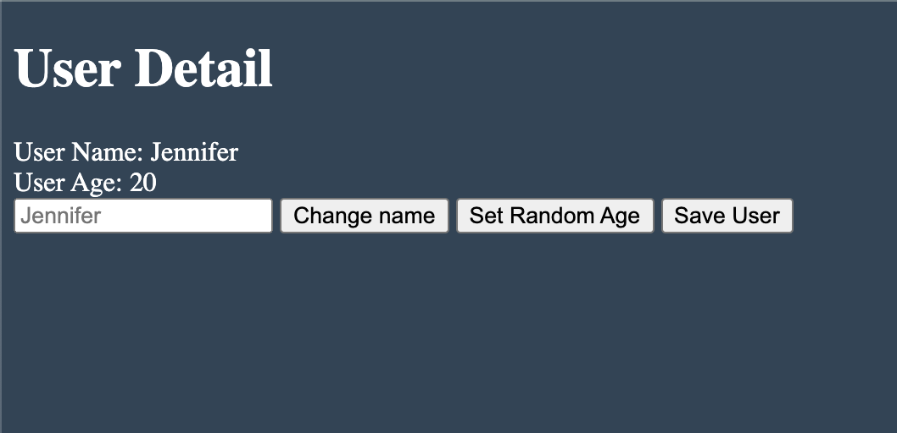
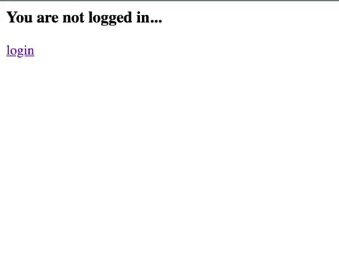

# ✨ content-ts ✨
---
 

## 👋 Introduction 
A small project centering around [TS](https://www.typescriptlang.org/) with [REACT](https://reactjs.org/), [EXPRESS](https://expressjs.com/) and [REDUX](https://redux.js.org/).

## 🫖 Explanations
- ✅ [**quickfetch**](https://github.com/jsoomie/content-ts/tree/main/quickfetch)
  - Goal is to be able to fetch JSON data and display to the user in a neat format. Format displayed data.
- ✅ [**features**](https://github.com/jsoomie/content-ts/tree/main/features)
  - Create Date type to show methods and created own class to implement my own types for it and methods to pull from. Difference between type annotations and type inferences. Explains in detail each types and how and when to implement.
- ✅ [**maps**](https://github.com/jsoomie/content-ts/tree/main/maps)
  - **PROJECT #1** - Displays user and company on a map pulling random data from fakerjs. Adds the ability to add markers depending on the latitude and longitude of said items. Displays marker details from a window that pops up on marker once clicked.
- ✅ [**sort**](https://github.com/jsoomie/content-ts/tree/main/sort)
  - **PROJECT #2** - To create a bubble sort method that can take in numbers, strings, and linkedlists. Despite Array.sort(), this is to showcase the use of interfaces and classes combination. Implement abstract classes.
- ✅ [**stats**](https://github.com/jsoomie/content-ts/tree/main/stats)
  - **PROJECT #3** - To load CSV data, parse, analyze, and report. Introduce generics. Composition vs Inheritance. Displays given in HTML. Static methods.
- ✅ [**web**](https://github.com/jsoomie/content-ts/tree/main/web)
  - **PROJECT #4** - Create a web framework! Creating a barebones framworks that gets user info from storage and have the ability to change user info and save it into storage. Being able to display the given data onto an HTML template.
- ✅ [**server**](https://github.com/jsoomie/content-ts/tree/main/server)
  - **PROJECT #5** - Create an express server twice. First time going through without really using TS while the other time brining in Express types to full implement TS. 
- ✅[**server_refactor**](https://github.com/jsoomie/content-ts/tree/main/server_refactor)
  - **PROJECT #5 REFACTOR** - This is the refactor of server files to take use of classes and fully implement TS with Express. Use of decorators and knowledge of metadata helps implements typescript class system to express.
- 🚧[**react-redux-ts**](https://github.com/jsoomie/content-ts/tree/main/react-redux-ts)
  - *PROJECT #6** - Create a quick todo app with REACT, redux and typescript.

## 🚜 Technologies and packages (🚜 updating...)
1. [React.js](https://reactjs.org/)
2. [Express.js](https://expressjs.com/)
3. [Redux.js](https://redux.js.org/)
4. [Yarn](https://yarnpkg.com/)
5. [Axios](https://axios-http.com/docs/intro)
6. [JSON Placeholder](https://jsonplaceholder.typicode.com/)
7. [ts-node](https://typestrong.org/ts-node/)
8. [Faker.js](https://www.npmjs.com/package/faker)
9. [Google Maps](https://developers.google.com/maps/documentation)
10. [Parcel](https://www.npmjs.com/package/parcel)
11. [JSON-Server](https://www.npmjs.com/package/json-server)
12. [Nodemon](https://nodemon.io/)
13. [concurrently](https://www.npmjs.com/package/concurrently)
14. [Cookie-Session](https://www.npmjs.com/package/cookie-session)
15. [Reflect Metadata](https://www.npmjs.com/package/reflect-metadata)

## 📷 Screenshots (🚜 updating...)
✨[**maps**](https://github.com/jsoomie/content-ts/tree/main/maps)✨

---
---

✨[**sort**](https://github.com/jsoomie/content-ts/tree/main/sort)✨

---
---

✨[**stats**](https://github.com/jsoomie/content-ts/tree/main/stats)✨

---
---

✨[**web**](https://github.com/jsoomie/content-ts/tree/main/web)✨

---
---

✨[**server**](https://github.com/jsoomie/content-ts/tree/main/server)✨

---
---

✨[**react-redux**](https://github.com/jsoomie/content-ts/tree/main/react-redux-ts)✨

---
---
## 📝 Daily Logs (🚜 updating...)
**9/27** - initial commit!  Add base axios request and now create interface of incoming data and set types. Create loggin function and set types to params. Create features folder to hold explanations of types. Types are references to the methods and functions that is avaiable to use for that certain data. Created class of color and attached own methods of display hex color, its name and so on. Type annotations: Code we add to tell TS what type of value a variable will refer to. Type inference: TS tries to figure out what type of value a variable refers to.

**9/28** - Add array types. Add Class Types. Add Object literal. Add function type. TS cannot infer types in JSON.parse() returns as any instead. Add functions explanations. Add object explanations and destructuring advice. Add arrays.ts and tuples.ts. Add interfaces in regards to functions and classes. Add classes. Starting first project that utilizes everything learned so far.

**9/29** - Create maps project. Add models of user and company and exported. Add google maps. Add interface for limited custommap. Add User and Company markers. Update interface to take in markercontent to display within the markers infowindow. Add interface to User class and Company class. 

Create sort project! Create tsconfig.json. Create a bubble sort algorithm thats going to work with numbers, strings and such. Add typeguards. Add seperate class of numbers collection and make interface to take in the sort class. Should be able to take in numbers, characters, and linked lists as long as the 3 properties of length, a swap method, and a swap method is defined from the interface.

**9/30** - Add Abstract classes. Implement abstract classes and go over difference between that and interfaces. Add project 3. Include csv file. Add generic to class. Create reuseable code. Add both inheritance and composition styles. Learn static methods in class.

**10/1** - Add structure to webframe app. Add json-server and add scripts in package.json to run them easier. Keys in objects can be a type as well. Refactor classes to create more generic reuseable code. Create collection class that takes in data and puts it in an array for full view types in html. Create a views class to display data onto html. User able to create and save to db.

**10/2** - Finish web framework app. Skeleton work familiar to Marionette.js and Backbone.js. Create a new starter app called server to use express and ts together. Middleware and unknown properties makes it difficult for TS to fully integrate with js frameworks.

**10/3** - Add comments to controllers. Add home routes, login routes, and protected routes. Add logout user and cookie-session. Create a new folder in repository to full showcase TS implementation and refactor. Overview of decorators in TS.

**10/4** - All things regarding metadata and how to attach to prototypes. Add singleton page for router to wrap around site. Create a new project folder for react redux ts.

**10/5** - Merged branch into main. Create basic reducer to handle fetch request.

**10/6** - Create delete actions to use. Moved logic out of action/index.ts to reserver index as an export file. Finish and basic styled react project!

---

## ✏️ Learner
[Jonathan Soukaseume](https://github.com/jsoomie)

---

## 🙏 Thanks!
Special thanks to [Stephen Grider](https://udemy.com/user/sgslo) for guiding me and thousands of others through it all! 

## LICENSE

